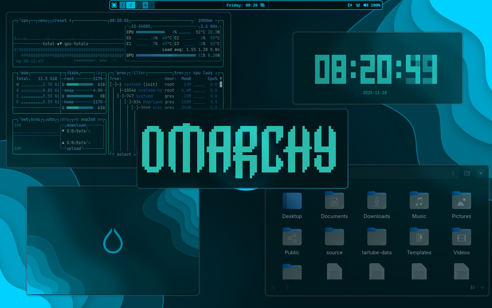
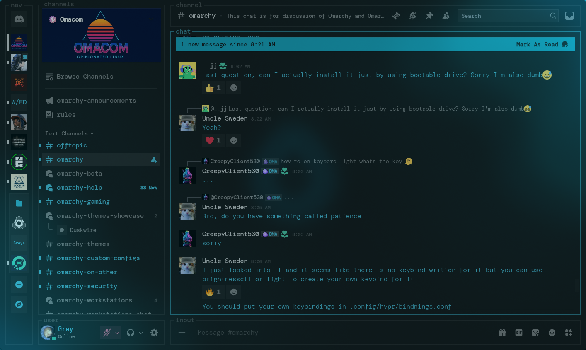

# HyprBlue Theme 💧🔷

HyprBlue is a bright, calm, and modern blue theme designed for **Omarchy**. It focuses on smooth visuals, cool tones, and a clean layout that feels refreshing every time you use your system. The theme brings together clarity, simplicity, and style in a way that works perfectly for daily use.

---

## ✨ Features

* Cool blue + aqua color palette for a relaxed aesthetic
* Clean and modern UI styling across Omarchy components
* Neatly designed layouts that stay readable and consistent
* Perfect balance of contrast and brightness for long sessions
* Works smoothly with Waybar, Eww, and Omarchy theming structure

---

## 📦 Installation

Install HyprBlue with a single command:

```
omarchy-theme-install https://github.com/Grey-007/hyprblue.git
```

This will automatically place everything in the right place and apply the theme.

---

## 🖼️ Screenshots

Preview the look of the HyprBlue theme:





---

## 💙 Credits

Made by **Grey-007**.
Thanks to the Omarchy community for tools, support, and inspiration.

---
